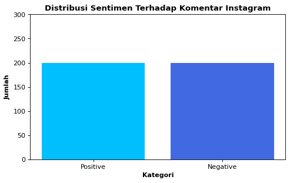
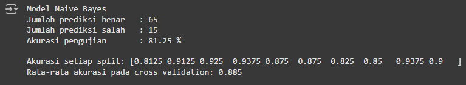
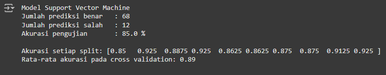

# sentimentanalysis_with_nbc_and_svm
Performed sentiment analysis on Instagram comments related to cyberbullying in Bahasa Indonesia. Using public datasets from GitHub. Display the data distribution, perform preprocessing, and possibly build a prediction model. And this project also uses two algorithms, namely Naive Bayes and Support Vector Machine.
# Distribution Dataset

# Accuracy Model Naive Bayes

# Accuracy Model Support Vector Machine

# Link Dataset
https://raw.githubusercontent.com/ksnugroho/klasifikasi-spam-sms/master/data/key_norm.csv
